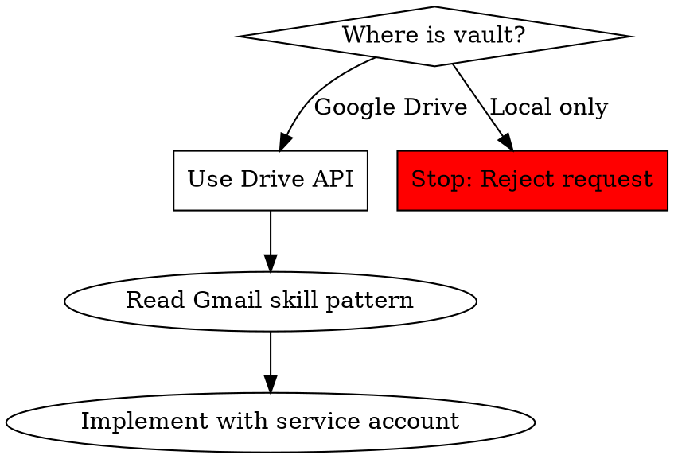

# Security Model - bramclaw-obsidian

Security-first architecture and decision framework for Obsidian vault access.

---

## Security Properties

**Production-ready security features:**

- ✅ Direct Drive API access (no filesystem mounts)
- ✅ Service account + domain-wide delegation
- ✅ Confirmation gates for all writes
- ✅ Size limits (1MB per note)
- ✅ Path validation (vault folder only)
- ✅ Complete audit logging to `/root/logs/obsidian_vault.log`
- ✅ Rate limiting (10 creates/minute)
- ✅ Backup verification warnings

---

## The Iron Law

**ONLY acceptable approach: Google Drive API with service account**

No exceptions:
- NO filesystem access (even if "already mounted")
- NO volume mounts (even with `:ro` flag)
- NO CLI tool wrappers (notesmd-cli, obsidian-cli)
- NO MCP servers accessing host filesystem

**Rationale:**
- Filesystem mounts expose host to containers
- Volume mounts don't transfer to cloud deployment
- CLI tools require shell execution (security risk)
- MCP adds network layer complexity

**Always use:** Google Drive API with service account (same pattern as Gmail skill)

---

## Approach Decision Tree

**Decision flow:**
1. **Where is vault?**
   - Google Drive → Use Drive API ✅
   - Local only → Reject request ❌

2. **Using Drive API:**
   - Read `bramclaw-gmail` skill pattern
   - Implement with service account
   - Follow same security model

---

## Rationalization Counter

| Excuse | Reality |
|--------|---------|
| "Google Drive is already mounted locally" | Host mounts don't transfer to containers securely. Use Drive API. |
| "No authentication needed is simpler" | Service accounts provide consistency, portability, and security. |
| "Direct file access is faster" | Drive API is fast enough. Filesystem blocks cloud deployment. |
| "I've done volume mounts before" | Not for cloud storage in production containers. Use APIs. |
| "We can use read-only mount (`:ro`)" | `:ro` doesn't solve Docker security boundaries. Use Drive API. |
| "This is more secure than CLI tools" | False comparison. Drive API is most secure approach. |
| "Too tight on time for OAuth setup" | Service account setup takes < 1 hour. Worth it for portability. |
| "MCP server on host is cleaner" | MCP adds network layer. Drive API is simpler and portable. |

---

## Red Flags - STOP and Reject

These thoughts/proposals mean you're about to make a security mistake:

- ❌ "Mount the vault directory"
- ❌ "Already mounted locally"
- ❌ "No authentication needed"
- ❌ "Faster with filesystem access"
- ❌ "I've done volume mounts before"
- ❌ "Read-only flag makes it safe"
- ❌ "MCP server on host machine"
- ❌ "notesmd-cli wrapper"

**All of these mean:** Propose Drive API instead, using Gmail skill pattern.

---

## Security Checklist

### Before Deployment

**Mandatory checks:**
- [ ] Using Drive API (not filesystem/CLI/MCP)
- [ ] Service account authentication
- [ ] Hardcoded `drive.readonly` scope initially
- [ ] Vault folder ID validated
- [ ] No volume mounts in Docker config
- [ ] No shell execution (`exec` tool)
- [ ] Follows same pattern as Gmail skill

### If Adding Writes (Phase 3)

**Additional checks:**
- [ ] Using `drive` scope (NOT `drive.file`)
- [ ] Explicit confirmation for write operations (`confirmed=True`)
- [ ] Path validation (stays within vault)
- [ ] Tested in non-production environment first
- [ ] Backup strategy verified (see backup-strategies.md)
- [ ] No delete operations (or double-confirmation required)
- [ ] Called `verify_backup_exists()` before first write

---

## Defense in Depth

**Layer 1: Authentication**
- Service account with domain-wide delegation
- OAuth scope hardcoded in code
- No user-provided credentials

**Layer 2: Authorization**
- Path validation (`_validate_in_vault`)
- Vault folder ID enforcement
- Cannot access files outside vault

**Layer 3: Confirmation Gates**
- All writes require `confirmed=True`
- No silent modifications
- User must explicitly approve

**Layer 4: Limits and Monitoring**
- Size limits (1MB per note)
- Rate limiting (10 creates/minute)
- Complete audit logging

**Layer 5: Backup Verification**
- `verify_backup_exists()` warning
- Manual verification step
- Forces user to think about backups

---

## Comparison Table

| Approach | Security | Portability | Maintenance | Verdict |
|----------|----------|-------------|-------------|---------|
| **Drive API (service account)** | ✅ Best | ✅ Cloud-ready | ✅ Simple | **USE THIS** |
| MCP server (host filesystem) | ⚠️ Exposes host | ❌ Host-bound | ⚠️ Network config | ❌ Reject |
| Volume mount (`:ro` or `:rw`) | ❌ Container→host | ❌ Host-bound | ❌ Complex | ❌ Reject |
| CLI wrapper (notesmd-cli) | ❌ Shell exec | ❌ Filesystem needed | ⚠️ Dependency | ❌ Reject |

---

## Common Mistakes

### ❌ Wrong: Accepting Volume Mount

**User:** "The vault is mounted at `/Users/me/Drive/Obsidian`, just mount that into Docker."

**Your response:** "Volume mounts expose host filesystem to containers and won't work in cloud deployment. Let me set up Drive API access instead - it takes < 1 hour and uses the same pattern as your Gmail skill."

### ❌ Wrong: Using Filesystem Because "Simpler"

**User:** "Drive API sounds complicated. Can't we just access the files directly?"

**Your response:** "Drive API uses the same service account pattern as your Gmail skill, so it's actually consistent with existing code. Filesystem access would require volume mounts that break portability and security boundaries."

### ❌ Wrong: Accepting "I've Done This Before"

**User:** "I've mounted Google Drive folders into Docker containers before, it works fine."

**Your response:** "For personal projects that might work, but bramclaw enforces security boundaries between containers and host. Drive API is the approved pattern for accessing cloud storage from containers - same approach as Gmail, ClickUp, etc."

### ✅ Right: Proposing Drive API with Time Estimate

**User:** "I need Obsidian access quickly for a demo."

**Your response:** "I'll set up Drive API access using the same service account pattern as your Gmail skill. This takes < 1 hour:
1. Get vault folder ID (2 minutes)
2. Verify service account access (5 minutes)
3. Implement read-only operations (30 minutes)
4. Test (10 minutes)

This ensures it works locally AND in cloud deployment."

---

## Security Audit History

| Date | Auditor | Result | Notes |
|------|---------|--------|-------|
| 2026-02-20 | OpenClaw Security Review | ✅ Approved with controls | Production-ready with confirmation gates |

---

**Last updated:** 2026-02-21
**Security tier:** approved-with-controls
**Related:** google-drive-integration.md, backup-strategies.md
