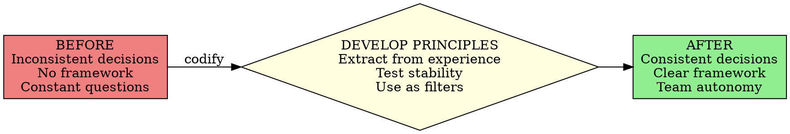

# Operating Principles Development

## Overview

**Core Principle:** Create a collection of 15-30 foundational guidelines that serve as "hoops through which all decisions must pass." These principles reflect your core beliefs about how the world works and how your organization operates.

**Key Insight:** Principles that remain stable over time prove their soundness. Unlike procedures that evolve constantly, Operating Principles change very little - their immutability is evidence of validity.

## When to Use

Use this skill when you observe these symptoms:

**Decision Inconsistency:**
- Same situation handled differently by different people
- Same situation handled differently by same person at different times
- No clear framework for making choices
- Decisions feel arbitrary or random
- Can't explain WHY certain decisions were made

**Team Confusion:**
- Team members unsure how to handle situations
- Constantly asking "What should I do about X?"
- No shared understanding of organizational values
- Conflicting approaches to similar problems
- Need leader approval for every decision

**Values Gaps:**
- Values conflicts without clear resolution method
- Aspirational values posted but not practiced
- Gap between stated beliefs and actual behavior
- No codified principles guiding daily work
- Culture is undefined or inconsistent

**Ready for Implementation:**
- Strategic Objective created and finalized
- Need next step in Work the System implementation
- Want to codify "how we think"
- Ready to create decision-making framework
- Need guidelines that reflect core beliefs

## Core Pattern



**The Fundamental Shift:**

| Without Operating Principles | With Operating Principles |
|------------------------------|---------------------------|
| Decisions vary by mood/person | Decisions consistent with beliefs |
| Team constantly asks for guidance | Team uses principles autonomously |
| Aspirational values ignored | Actual beliefs codified and used |
| No explanation for choices | Clear rationale for every decision |
| Culture undefined | Culture explicit and stable |
| Reactive decision-making | Principle-based decision-making |

## Quick Reference

### Operating Principles Specifications

**Format:**
- **Number:** 15-30 principles typically
- **Type:** Nonlinear Working Procedure (set of components, not sequential)
- **Author:** Leader creates with input from team
- **Tone:** Simple, sensible, tried and true
- **Longevity:** Very stable; immutability = soundness

**Characteristics:**
- Reflect core beliefs (not aspirations)
- Simple to understand and remember
- Lie quietly beneath events of the day
- Change very little with circumstances
- Guide decision-making across spectrum

**Time Investment:**
- Accumulation: 2-5 minutes throughout each day
- Polishing: 10-20 hours scattered over 1-2 months
- **Total:** Organic accumulation (not one sitting)

### Operating Principles vs Mission Statement

| Mission Statement (Wrong) | Operating Principles (Right) |
|---------------------------|------------------------------|
| Aspirational and hopeful | Actual and practiced |
| What we wish we valued | What we actually believe |
| Designed to impress | Designed to guide |
| Ignored after creation | Referenced constantly |
| Generic and vague | Specific and clear |
| Feel-good fluff | Decision-making tools |

### How Principles Function

**Principles are "hoops through which all decisions must pass":**

```
Decision Opportunity
        ↓
Does it pass Principle #1? → No → Reject
        ↓ Yes
Does it pass Principle #2? → No → Reject
        ↓ Yes
Does it pass Principle #3? → No → Reject
        ↓ Yes
    ... (all principles) ...
        ↓ Yes to all
    Approve Decision
```

**All major decisions must pass through ALL principle hoops. One "no" = reject the decision.**

## Implementation

### Step 1: Ensure Strategic Objective Exists

**Prerequisite Check:**
- [ ] Strategic Objective created and finalized
- [ ] One-page document completed
- [ ] Team understands organizational direction
- [ ] SO posted and referenced regularly

**If not ready:** Use strategic-objective-creation skill first. Operating Principles must be congruent with Strategic Objective. You need direction before you can create guidelines.

### Step 2: Understand What Principles Are

**Operating Principles are:**
- Foundational beliefs about how your world works
- Guidelines extracted from daily experience
- Statements of what you ACTUALLY believe (not wish you believed)
- Decision filters for organizational choices
- Stable over time (unlike procedures which evolve)

**Operating Principles are NOT:**
- Aspirational values
- Marketing slogans
- Mission statement fluff
- Tactical procedures
- Wishful thinking

**Examples from Centratel:**

**Principle #8:** "Just a few services implemented in superb fashion"
- *What it means:* Focus on core competencies, don't dilute with add-ons
- *Real decision:* Stopped selling cellular phones (couldn't control quality)
- *Impact:* Simplified operation, ensured all products are high quality

**Principle #30:** "We strive for a social climate that is serious and quiet yet pleasant, serene, light, and friendly"
- *What it means:* Workplace environment supports focused work
- *Real decision:* Open layout, live plants, special lighting, orderliness
- *Impact:* Comfortable workplace matching stated principle

### Step 3: Begin Capturing Principles

**Start after Strategic Objective draft is complete.**

**The Accumulation Method:**

Operating Principles emerge gradually. You don't sit down and write all 30 at once. Instead:

1. **Keep notebook/notes app handy** - Principles will pop into your head throughout the day

2. **Ask yourself:** "What do I believe about how this should work?"
   - When making decisions
   - When observing what works/doesn't work
   - When explaining choices to team
   - When seeing patterns in success/failure

3. **Write them down as they emerge:**
   - "We believe X"
   - "Our approach to Y is Z"
   - "We value A over B because C"

4. **Take 2-5 minutes per principle** - Jot down the essence, refine later

**Starter Questions:**

- What beliefs guide my best decisions?
- What patterns do I see in our successes?
- What do I value in our work?
- What trade-offs do I consistently make?
- How do I think the world works?
- What's non-negotiable for us?

### Step 4: Seek Input from Team

**The Collaborative Process:**

**Do:**
- Ask team: "What principles do you see me/us following?"
- Listen for patterns in their observations
- Note principles they articulate that you haven't
- Gather perspectives from multiple team members
- Take notes on their suggested principles

**Don't:**
- Let committee design principles
- Include principles you don't actually believe
- Add aspirational values to look good
- Compromise your beliefs to please everyone
- Dilute principles to avoid conflict

**Your Role:** You're gathering input, not delegating creation. The final principles must reflect YOUR beliefs and YOUR vision for the organization.

**Example Input Session:**
- "When I make decisions, what patterns do you notice?"
- "What values do you see us practicing (not just saying)?"
- "What principles guide how we handle X situation?"
- "What makes our approach different from competitors?"

### Step 5: Test Principles Against Reality

**The Reality Test:**

For each candidate principle, ask:

**1. Do we ACTUALLY practice this?**
- Not: "Should we do this?" or "Would this be nice?"
- But: "Do we already do this consistently?"
- If aspirational (not actual), DELETE it

**2. Does this reflect my real beliefs?**
- Would I defend this principle under pressure?
- Do I make decisions based on this?
- Is this how I actually think?
- If not genuine, DELETE it

**3. Is this congruent with Strategic Objective?**
- Does it support our what/where/how?
- Could it conflict with our goals?
- Does it guide us toward our objectives?
- If misaligned, DELETE or REVISE it

**4. Is it simple and clear?**
- Can team members understand it?
- Can it be stated in one sentence?
- Is the meaning obvious?
- If convoluted, SIMPLIFY it

### Step 6: Refine and Polish

**Accumulation Timeline:** 1-2 months of organic gathering

**Polishing Process:**

**Week 1-2:**
- Capture initial 10-15 principles from your head
- Write down as they occur to you
- Don't worry about perfect wording yet
- Focus on getting core beliefs documented

**Week 3-4:**
- Seek team input
- Add principles others identify
- Begin refining wording
- Group similar principles
- Aim for 15-25 total

**Week 5-6:**
- Polish language for clarity
- Remove redundancy
- Test each against reality
- Ensure congruence with Strategic Objective
- Order logically (if needed)

**Week 7-8:**
- Finalize wording
- Create final document (2-3 pages typical)
- Number principles for reference
- Share draft with team for feedback

**Total Time:** 10-20 hours scattered over 1-2 months (not one marathon session)

### Step 7: Stabilize and Validate

**The Stability Test:**

Operating Principles prove their soundness through immutability.

**After finalizing principles:**

1. **Use them for 30-60 days**
   - Reference in decisions
   - Apply as filters
   - Notice which ones you actually use
   - Notice which ones feel wrong

2. **Track changes:**
   - Principles that need frequent revision = not core beliefs
   - Principles that stay stable = valid and sound
   - Delete unstable principles
   - Keep rock-solid ones

3. **The Validation Rule:**
   - If principle remains unchanged for 60+ days = VALID
   - If principle needs constant tweaking = DELETE or RETHINK
   - Stable principles = true beliefs
   - Unstable principles = aspirations or wishes

**Expected Outcome:**
- 80-90% of final principles will remain unchanged
- 10-20% might be revised or removed
- After 6 months, very little change occurs
- This stability confirms soundness

### Step 8: Use Principles as Decision Filters

**Daily Application:**

Every decision must pass through principle hoops:

**Example Decision: Client requests custom work outside normal service**

Pass through each principle:
- Principle #8 "Just a few services in superb fashion" → Does custom work dilute focus? → NO = Reject
- (If YES, continue to next principle)

**Example Decision: Hire additional staff member**

Pass through each principle:
- Principle #30 "Serious and quiet yet pleasant" → Will this person fit our culture? → Check
- Principle #X "Drug-free workplace" → Will they pass screening? → Check
- Principle #Y "Quality over speed" → Do we need them for quality or just volume? → Check
- All pass → Approve hire

**Example Decision: Change in office layout**

Pass through principles:
- Principle #30 "Serious and quiet" → Does layout support this? → Check
- Principle #X "Orderliness" → Is new layout more organized? → Check
- All pass → Approve change

**The Filter Process:**
1. Decision opportunity arises
2. State the decision clearly
3. Run through ALL principles
4. ANY principle says "no" → Reject decision
5. ALL principles say "yes" → Approve decision

## Common Mistakes

### Mistake 1: Creating Aspirational Values Instead of Actual Beliefs

**Symptom:** Principles describe who you WISH you were, not who you ARE

**Fix:** For each principle, ask: "Do we ACTUALLY practice this today?" If answer is "Well, we'd like to..." then DELETE it. Only include principles you already follow. Operating Principles codify reality, not aspirations.

### Mistake 2: Writing All Principles in One Sitting

**Symptom:** Sitting down to "write 30 principles" in a marathon session

**Fix:** STOP. Principles emerge gradually over weeks. Start with 5-10 obvious ones, then capture additions as they occur to you throughout daily work. Accumulate organically over 1-2 months. Forced creation produces fluff, not truth.

### Mistake 3: Letting Committee Design Principles

**Symptom:** Group brainstorming session where everyone suggests principles and you compromise

**Fix:** YOU create principles based on YOUR beliefs. Get input, yes. Listen to observations, yes. But final principles reflect YOUR vision. Leadership means leading. Team can validate principles, not design them.

### Mistake 4: Including Tactical Procedures as Principles

**Symptom:** "We use QuickBooks for accounting" or "We answer phones within 3 rings"

**Fix:** These are procedures, not principles. Principles are BELIEFS: "We value accuracy in financial tracking" or "We prioritize responsiveness to clients." Principles guide tactics; they aren't tactics themselves.

### Mistake 5: Making Them Too Vague

**Symptom:** "We believe in excellence" or "We value integrity"

**Fix:** Too generic. Be specific to YOUR organization. What does excellence mean for YOU? "We are the highest-quality [service] provider" is specific. "Just a few services in superb fashion" is specific. Generic = useless. Specific = useful.

### Mistake 6: Not Using Them as Filters

**Symptom:** Created beautiful principles document, filed it away, never reference it

**Fix:** Principles are TOOLS. Use them in EVERY decision. Post them visibly. Reference them in meetings. "Does this pass our principles?" should be standard question. If not using daily, they're decorative not functional.

### Mistake 7: Changing Them Too Frequently

**Symptom:** Constant revisions, tweaking weekly, adding new ones constantly

**Fix:** Stability = validation. If principles need constant changes, they're not core beliefs yet. Let them settle. Test them over time. True principles remain stable for months/years. Frequent changes mean you haven't found bedrock beliefs yet.

### Mistake 8: Creating Before Strategic Objective

**Symptom:** Want to start with principles before defining organizational direction

**Fix:** SEQUENCE MATTERS. Strategic Objective FIRST, then Operating Principles. Principles must be congruent with your Strategic Objective. Without SO, you have no foundation. Do strategic-objective-creation skill first.

## Real-World Impact

**Sam Carpenter's Centratel Example:**

**Operating Principles Created:**
- Named "Thirty Principles" (30 separate operating principles)
- 2-3 pages total
- Accumulated over several weeks
- Created after Strategic Objective draft
- Congruent with SO goals

**Example Principles in Action:**

**Principle #8: "Just a few services implemented in superb fashion"**
- Guided decision to stop selling cellular phones
- Couldn't control quality of cellular company's customer service
- Simplified operation to focus on core competency
- All products now high quality with no exceptions

**Principle #30: "Social climate that is serious and quiet yet pleasant, serene, light, and friendly"**
- Tangible impact on office design
- Open physical layout
- Live decorative plants
- Special full-spectrum lighting
- Orderliness and quietness
- Comfortable workplace that matches written principle

**Characteristics of Centratel's Principles:**
- Simple and sensible
- Tried and true
- Lie quietly beneath events of the day
- Change very little with evolving circumstances
- Adjusted occasionally but overall immutability = soundness
- Function as hoops ALL decisions pass through

**Key Quote:**
> "The General Operating Principles, like the elements of the Strategic Objective, keep us steadily moving in a focused direction whether there's a tendency toward nonaction on the one hand or a momentary burst of impetuousness on the other. We are dogmatic about following our principles."

**Decision Example (Drug Testing Policy):**
- Strategic Objective demanded stable, clear-thinking workforce
- Operating Principles guided implementation
- Principle-driven decision made from outside-and-slightly-elevated view
- Traded difficulty finding drug-free candidates for stability
- Result: Minimal turnover, consistent quality, principle upheld

**Integration with Other Documents:**
- Strategic Objective provides direction
- Operating Principles guide decision-making within that direction
- Working Procedures execute decisions following the principles
- All three work together as integrated system

## Next Steps

After creating your Operating Principles, proceed to:

1. **working-procedures-documentation** - Create exact step-by-step protocols that execute within the framework of your Strategic Objective and Operating Principles
2. Review Strategic Objective and Operating Principles together regularly
3. Use principles as filters for every decision
4. Test stability over time (immutability = validation)

**IMPORTANT:** Operating Principles should remain very stable. If you're changing them frequently, they're not core beliefs yet. Let them settle and prove their soundness through stability.

## Quick Self-Assessment

You've successfully created functional Operating Principles when you can:

- [ ] List 15-30 foundational principles
- [ ] Principles reflect actual beliefs (not aspirations)
- [ ] Principles remain stable over time (60+ days unchanged)
- [ ] Use principles to filter every major decision
- [ ] Team members understand and reference principles
- [ ] Principles align with Strategic Objective
- [ ] Can explain rationale behind each principle
- [ ] Principles are simple and clear
- [ ] Notice consistent decision-making based on principles
- [ ] Principles feel true to organizational character

If you can't check these boxes, revisit Steps 1-8 above. Operating Principles must be genuine beliefs, not aspirational fluff.

## Example Principle Format

**Format each principle clearly:**

```
GENERAL OPERATING PRINCIPLES
[Your Organization Name]

Congruent with our Strategic Objective, these are the foundational
principles that guide all decision-making:

1. [Principle stating core belief]

2. [Principle stating core belief]

3. [Principle stating core belief]

...

[Continue through all principles]

Every decision, large or small, must pass through these principle
hoops. We are dogmatic about following our principles.
```

**Individual Principle Examples:**

Good:
- "Just a few services implemented in superb fashion"
- "Social climate that is serious and quiet yet pleasant"
- "Quality over speed in all operations"
- "Drug-free workplace ensures stable, clear-thinking staff"
- "Orderliness creates peace and efficiency"

Bad (too vague):
- "We believe in excellence"
- "Customer satisfaction is important"
- "We value our employees"
- "Integrity matters"
- "We work hard"

Be specific to YOUR organization and YOUR actual beliefs.
