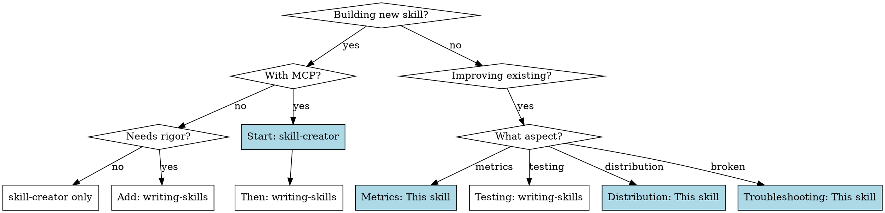

# Skill Building Complete

## Overview

This skill is the primary skill-creator for this environment. It fills critical gaps identified in Anthropic's latest official guide (2026) and extends legacy creator workflows with:

1. **MCP Integration** (Category 3 use cases, multi-MCP coordination)
2. **Success Metrics** (quantitative measurement framework)
3. **Distribution** (GitHub/API deployment workflows)
4. **Implementation Patterns** (5 patterns from new guide)
5. **Combined Workflow** (how to use this skill with writing-skills)

**When to use this skill vs. others:**
- Use `skill-creator` (this skill) for: Tooling, MCP integration, metrics, distribution, troubleshooting
- Use `writing-skills` for: TDD rigor (RED-GREEN-REFACTOR), testing methodology, CSO optimization

## Quick Decision Tree

## Core Capabilities

This skill provides 5 key capabilities missing from both existing skills:

### 1. MCP Integration Patterns

**What**: Category 3 use cases and multi-MCP coordination

**When to use**: Building skills FOR MCP servers or coordinating multiple MCPs

**Deep dive**: See `references/mcp-integration-patterns.md` for:
- What is Category 3 (MCP Enhancement)
- Single MCP workflow patterns
- Multi-MCP coordination (Figma → Drive → Linear → Slack example)
- MCP fallback strategies and error handling
- Testing MCP-dependent skills

**Quick reference**:
- Single MCP: Embed domain expertise + orchestrate MCP calls
- Multi-MCP: Phase separation + data passing + validation gates
- Always: Graceful degradation when MCP unavailable

### 2. Success Metrics Framework

**What**: Quantitative and qualitative measurement of skill effectiveness

**When to use**: After building skill, to measure if it actually works

**Deep dive**: See `references/success-metrics-framework.md` for:
- Quantitative metrics (90% triggering, tool call efficiency, API success rate)
- Qualitative metrics (user autonomy, consistency, first-try success)
- Baseline comparison methodology
- Improvement targets

**Quick reference**:
- Run `scripts/check_triggering_accuracy.py` for trigger testing
- Run `scripts/measure_skill_performance.py` for performance comparison
- Target: 90% triggering accuracy, 50%+ token reduction, 0 failed APIs

### 3. Distribution & Deployment

**What**: How to properly share and deploy skills

**When to use**: After skill is packaged, before sharing with others

**Deep dive**: See `references/distribution-deployment-guide.md` for:
- GitHub hosting guide (repo structure, README template)
- API usage (when to use /v1/skills endpoint vs. Claude.ai)
- Linking from MCP docs
- Positioning your skill (outcome-focused messaging)
- Version management

**Quick reference**:
- Use `assets/distribution-checklist.md` before deploying
- Individual users: GitHub → Download → Upload to Claude.ai
- Organizations: Admin deployment (workspace-wide)
- Programmatic: API endpoint + Claude Agent SDK

### 4. Implementation Patterns

**What**: 5 proven patterns from Anthropic's 2026 guide

**When to use**: When designing skill workflows

**Deep dive**: See `references/implementation-patterns.md` for:
- Pattern 1: Sequential workflow orchestration
- Pattern 2: Multi-MCP coordination
- Pattern 3: Iterative refinement
- Pattern 4: Context-aware tool selection
- Pattern 5: Domain-specific intelligence

**Quick reference**:
- Sequential: Explicit step ordering + validation + rollback
- Multi-MCP: Phase separation + data passing + centralized errors
- Iterative: Quality criteria + know when to stop
- Context-aware: Decision criteria + fallback options
- Domain intelligence: Embed expertise + compliance before action

### 5. Troubleshooting

**What**: Debug common skill issues

**When to use**: Skill won't upload, doesn't trigger, or isn't being followed

**Deep dive**: See `references/troubleshooting-guide.md` for:
- Upload errors (YAML formatting, naming issues)
- Triggering issues (too generic, too specific)
- MCP connection problems
- Instructions not followed
- Large context issues

**Quick reference**:
- Won't upload: Check SKILL.md case-sensitive naming, YAML delimiters
- Doesn't trigger: Ask Claude "When would you use this skill?", add specific triggers
- Triggers too often: Add negative triggers ("Do NOT use for...")
- Not followed: Keep concise, put critical info at top

## Combined Workflow (10 Steps)

This workflow integrates skill-creator + writing-skills + this meta-skill:

**Planning Phase**:
1. **Define use cases** (skill-creator Step 1)
   - Identify 2-3 concrete examples
   - Determine if MCP-related (Category 3?)
   - Document what users will say to trigger skill

2. **Run baseline WITHOUT skill** (writing-skills RED phase)
   - Try the task without any skill present
   - Document exact failures, rationalizations, inefficiencies
   - This is critical: understand the problem before building solution

3. **Plan reusable contents** (skill-creator Step 2)
   - Scripts for deterministic operations
   - References for detailed documentation
   - Assets for templates/output files
   - If MCP-related: Review `references/mcp-integration-patterns.md`

**Build Phase**:
4. **Initialize skill** (skill-creator Step 3)
   - Run: `init_skill.py skill-name --path ./skills`
   - Creates proper directory structure
   - Generates SKILL.md template

5. **Write minimal skill** (writing-skills GREEN phase)
   - Address specific baseline failures (not hypothetical cases)
   - Follow progressive disclosure (SKILL.md < 500 lines)
   - Link to references/ for details
   - If MCP: Use patterns from `references/mcp-integration-patterns.md`
   - If workflow: Use patterns from `references/implementation-patterns.md`

**Test Phase**:
6. **Test triggering** (this skill)
   - Create test queries using `assets/test-queries-template.txt`
   - Run: `scripts/check_triggering_accuracy.py`
   - Target: 90% accuracy on should-trigger queries

7. **Test functionality** (writing-skills + this skill)
   - Run same task WITH skill
   - Verify correct outputs, no failed API calls
   - If MCP: Run `scripts/validate_mcp_integration.py`

8. **Measure performance** (this skill)
   - Run: `scripts/measure_skill_performance.py`
   - Compare baseline (Step 2) vs. with-skill (Step 7)
   - Document in `assets/success-metrics-template.csv`
   - Target: 50%+ token reduction, fewer tool calls, 0 failed APIs

**Package Phase**:
9. **Package and validate** (skill-creator Step 5)
   - Run: `package_skill.py ./skills/skill-name`
   - Validates YAML, structure, naming conventions
   - Creates .skill file for distribution

10. **Close loopholes + distribute** (writing-skills REFACTOR + this skill)
    - Identify new rationalizations from testing
    - Add explicit counters (for discipline skills)
    - Use `assets/distribution-checklist.md` before deploying
    - Follow `references/distribution-deployment-guide.md` for GitHub/API

## When MCP Integration Applies

**Category 3: MCP Enhancement** - Your skill's PRIMARY purpose is enhancing MCP server usage

**Examples**:
- Linear sprint planning skill (coordinates Linear MCP calls)
- Sentry code review skill (uses Sentry MCP + GitHub MCP)
- Design handoff skill (Figma → Drive → Linear → Slack coordination)

**How to identify**:
- Skill can't function without MCP access
- Skill orchestrates multiple MCP calls in sequence
- Skill embeds domain expertise about how to use MCP service
- Skill solves "users connect MCP but don't know what to do next"

**Deep dive**: `references/mcp-integration-patterns.md`

**Testing**: `scripts/validate_mcp_integration.py`

## When Success Metrics Apply

**Always.** Every skill should be measured for effectiveness.

**Minimum viable metrics**:
1. **Triggering accuracy**: Run 10-20 test queries, measure trigger rate
2. **Token efficiency**: Compare baseline vs. with-skill
3. **Qualitative check**: Can new user complete task on first try?

**Full metrics** (for production skills):
- Use `scripts/check_triggering_accuracy.py`
- Use `scripts/measure_skill_performance.py`
- Track in `assets/success-metrics-template.csv`
- Iterate if triggering < 90% or no token reduction

**Deep dive**: `references/success-metrics-framework.md`

## When Distribution Applies

**Always** - even for personal skills, proper distribution avoids issues later.

**Minimum viable distribution**:
1. Package with `package_skill.py` (validates structure)
2. Test upload to Claude.ai (catch issues early)
3. Version in metadata (for future updates)

**Full distribution** (for shared/public skills):
- GitHub repo with README
- Installation instructions
- Link from MCP docs (if MCP-related)
- API testing (if programmatic use case)
- Use `assets/distribution-checklist.md`

**Deep dive**: `references/distribution-deployment-guide.md`

## Common Mistakes

| Mistake | Impact | Fix |
|---------|--------|-----|
| Skip baseline testing | Don't know what problem you're solving | Always run Step 2 (writing-skills RED) |
| Duplicate existing skill content | Context bloat, maintenance burden | Cross-reference, don't duplicate |
| No MCP fallback strategy | Skill breaks when MCP disconnected | Always handle MCP failures gracefully |
| No success metrics | Can't prove skill is effective | Run Step 8 (measure performance) |
| Skip distribution checklist | Upload fails, users can't install | Use `assets/distribution-checklist.md` |
| Description too technical | Skill doesn't trigger | Focus on WHEN to use, not HOW it works |
| SKILL.md > 500 lines | Excessive context consumption | Move details to references/ |

## Quick Reference

### For MCP Skills
1. Read `references/mcp-integration-patterns.md`
2. Choose pattern (single MCP vs. multi-MCP)
3. Add MCP error handling (disconnect, auth failure, rate limit)
4. Test with `scripts/validate_mcp_integration.py`

### For Measuring Skills
1. Define baseline (run task WITHOUT skill)
2. Run `scripts/check_triggering_accuracy.py` (target: 90%)
3. Run `scripts/measure_skill_performance.py` (target: 50% token reduction)
4. Track in `assets/success-metrics-template.csv`
5. Run `scripts/run_skill_quality_gate.sh` for full pre-release gate

### For Distributing Skills
1. Package with `package_skill.py`
2. Complete `assets/distribution-checklist.md`
3. Follow `references/distribution-deployment-guide.md`
4. Test via Claude.ai upload OR API endpoint

### For Troubleshooting
1. Check `references/troubleshooting-guide.md`
2. Common issues:
   - Won't upload: SKILL.md naming, YAML format
   - Doesn't trigger: Description too generic
   - Triggers too often: Add negative triggers
   - Not followed: Too verbose, bury critical info

## Resources Structure

This skill uses all three resource types:

### `scripts/`
Executable Python scripts for measurement and validation:
- `measure_skill_performance.py` - Baseline vs. with-skill comparison
- `check_triggering_accuracy.py` - Trigger rate measurement
- `validate_mcp_integration.py` - MCP connection testing
- `run_skill_quality_gate.sh` - One-command pre-release quality gate

### `references/`
Detailed guides for deep dives:
- `mcp-integration-patterns.md` - Category 3 use cases, multi-MCP (~400 lines)
- `success-metrics-framework.md` - Measurement methodology (~300 lines)
- `distribution-deployment-guide.md` - GitHub/API workflows (~350 lines)
- `implementation-patterns.md` - 5 patterns from new guide (~400 lines)
- `troubleshooting-guide.md` - Common issues and fixes (~250 lines)
- `combined-workflow.md` - How to use all 3 skills together (~200 lines)

### `assets/`
Templates and checklists:
- `success-metrics-template.csv` - Track measurements over time
- `trigger-results-sample.csv` - Sample triggering results for gate/script smoke test
- `distribution-checklist.md` - Pre-deployment validation
- `test-queries-template.txt` - Sample queries for trigger testing

## Next Steps

After using this skill to build your skill:

1. **Iterate based on metrics** - If triggering < 90%, revise description
2. **Collect user feedback** - Monitor real usage, not just tests
3. **Update version** - Increment metadata.version when improving
4. **Share learnings** - If you discover new patterns, contribute back

## Cross-References

**Complementary skills**:
- `skill-creator` - For init/package tooling and progressive disclosure patterns
- `writing-skills` - For TDD methodology and rationalization analysis

**Official resources**:
- Anthropic Complete Guide (2026) - This skill implements patterns from Chapters 1-5
- Anthropic Agent Skills repo - Public skill examples
- Skills API documentation - For programmatic usage
