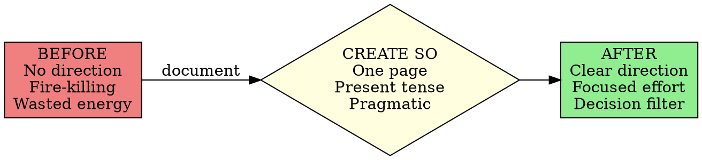

# Strategic Objective Creation

## Overview

**Core Principle:** Create a one-page, present-tense, pragmatic document that defines what your organization does, where it's headed, and how it will get there. This becomes the decision filter for all activities.

**Key Insight:** You'll be in the top 1% of small business owners who have written direction. The physical world aligns with what you write down.

## When to Use

Use this skill when you observe these symptoms:

**Direction Problems:**
- No clear organizational goals or targets
- Team members don't know the company's purpose
- Can't answer "What are we trying to achieve?"
- Relying on vague hopes instead of concrete plans
- Serial fire-killing with no underlying direction

**Decision Chaos:**
- Conflicting priorities across the organization
- Time and energy wasted on non-contributing activities
- Can't filter good opportunities from distractions
- Every decision feels arbitrary
- No framework for saying "no" to requests

**Documentation Gaps:**
- Have mission statement fluff but no real strategy
- Multi-page plans that nobody follows
- Future-tense wishes ("We will be...") instead of present declarations
- Committee-designed documents that please everyone but guide no one
- Strategic plans gathering dust on shelves

**Ready for Implementation:**
- Adopted Work the System mindset (outside-and-slightly-elevated perspective)
- Completed mindset shift and ready to document direction
- Need foundation before creating Operating Principles
- Starting systematic business improvement
- Want to move from reactive chaos to proactive control

## Core Pattern



**The Fundamental Shift:**

| Without Strategic Objective | With Strategic Objective |
|------------------------------|--------------------------|
| Fire-killing without purpose | Purpose-driven system work |
| Vague hopes and wishes | Concrete goals and strategies |
| Committee confusion | Leader-driven clarity |
| Future tense "We will be..." | Present tense "We ARE..." |
| Multi-page plans ignored | One-page document used daily |
| Wasted energy on distractions | Focused effort on objectives |

## Quick Reference

### Strategic Objective Specifications

**Format:**
- **Length:** One single-spaced page (strict limit)
- **Tense:** Present tense declarations ("We are..." not "We will be...")
- **Tone:** Pragmatic, mechanical, non-wishful-thinking
- **Author:** Leader alone (seek input but you decide)
- **Longevity:** Relatively static; minor revisions only

**Required Content:**
1. **What** - What the organization does
2. **Where** - Where it's headed (concrete goals)
3. **How** - How it will get there (specific strategies)

**Time Investment:**
- Draft: 3-4 hours
- Review and refine: 2-3 hours
- Finalize: 1 hour
- **Total: 6-8 hours** (one-time investment with hundredfold return)

### Not a Mission Statement

| Mission Statement (Avoid) | Strategic Objective (Use) |
|---------------------------|---------------------------|
| Feel-good fluff | Reality-based mechanics |
| Impresses board/stockholders | Guides daily decisions |
| Designed by committee | Created by leader |
| Makes people feel good | Makes organization effective |
| Syrupy excess | Concise blueprint |
| Ignored after creation | Referenced constantly |

### Purpose and Function

**The Strategic Objective prevents:**
- Wasted time on non-contributing activities
- Conflicting priorities
- Fire-killing without direction
- Team confusion about purpose
- Energy spent on distractions

**The Strategic Objective enables:**
- Clear decision filtering ("Does this support our SO?")
- Focused allocation of resources
- Team alignment on direction
- Foundation for Operating Principles
- Foundation for Working Procedures

## Implementation

### Step 1: Ensure Systems Mindset Is Adopted

**Prerequisite Check:**
- [ ] Can view organization from outside-and-slightly-elevated perspective
- [ ] See business as collection of systems, not chaos
- [ ] Understand controllable vs uncontrollable factors
- [ ] Ready to document reality (not wishful thinking)

**If not ready:** Use work-the-system-mindset skill first. Strategic Objective won't work without the foundational perspective shift.

### Step 2: Block Uninterrupted Time

**Schedule:**
- 3-4 hours for initial draft
- Solo work (no committee, no interruptions)
- Choose time when you're mentally fresh
- Have coffee/water, no phone, door closed

**Mental State:**
- Outside-and-slightly-elevated perspective active
- Looking down at organization as a machine
- Thinking mechanically, not emotionally
- Reality-based, not hope-based

### Step 3: Answer Three Core Questions

**Question 1: What does the organization do?**
- Be specific and concrete
- Avoid vague generalities
- State actual services/products
- Define who you serve

**Question 2: Where is it headed?**
- State concrete, measurable goals
- Use present tense ("We are..." not "We will be...")
- Be ambitious but grounded in reality
- Define what "best" or "success" means with specifics

**Question 3: How will it get there?**
- List specific strategies
- Mechanical steps, not hopeful wishes
- What systems need improvement?
- What focus areas are critical?

### Step 4: Write in Present Tense

**The Present Tense Rule:**

This is CRITICAL. Do NOT write:
- "We will be the best..."
- "Our goal is to become..."
- "We hope to achieve..."

Instead write:
- "We ARE the best..."
- "We provide the highest quality..."
- "We maintain industry-leading..."

**Why present tense matters:**
- Declares reality you're creating NOW
- Aligns mind with target state
- Eliminates wishful-thinking tone
- Creates psychological commitment
- Physical world aligns with written declaration

**Example Transformation:**

❌ **Wrong (Future Tense):**
"We will become the highest-quality service provider in our region by improving our processes and training our staff better."

✅ **Right (Present Tense):**
"We are the highest-quality service provider in our region. Our processes are streamlined and documented. Our staff receives comprehensive training and follows exact procedures."

### Step 5: Keep It to One Page

**The One-Page Discipline:**

**Why one page?**
- Forces clarity and focus
- Gets read and used (not filed away)
- Easy to remember and reference
- Prevents committee bloat
- Ensures conciseness

**If you're over one page:**
1. Remove generalities and fluff
2. Eliminate repetition
3. Cut aspirational language
4. Focus on concrete specifics
5. Trust that one page is enough

**Format:**
- Single-spaced
- Standard font (11-12pt)
- Clear section headers
- Short paragraphs
- Bullet points acceptable

### Step 6: Get Feedback (But Lead)

**The Feedback Process:**

**Do:**
- Show draft to trusted team members
- Ask: "Does this reflect our reality and direction?"
- Listen to concerns and suggestions
- Gather diverse perspectives
- Take notes on feedback

**Don't:**
- Design by committee
- Let others write it
- Dilute with compromises
- Add fluff to please everyone
- Defer to group consensus

**Your Role:** You are the leader. You make the final decision. Seek input, but the Strategic Objective reflects YOUR vision from YOUR outside-and-slightly-elevated view.

### Step 7: Refine and Finalize

**Refinement Checklist:**

- [ ] One page, single-spaced
- [ ] Present tense throughout
- [ ] Pragmatic tone (no fluff)
- [ ] What/where/how clearly stated
- [ ] Concrete goals (not vague wishes)
- [ ] Specific strategies (not generalities)
- [ ] Reality-based (not aspirational)
- [ ] Can be used as decision filter

**Polish:**
- Let it sit 24 hours, review fresh
- Read aloud (catches awkward phrasing)
- Remove every unnecessary word
- Ensure clarity over cleverness
- Check that it guides actual decisions

**Finalize:**
- Print physical copy
- Post where you'll see it daily
- Share with entire team
- Reference in every major decision
- Update only when reality changes

### Step 8: Use as Decision Filter

**Daily Application:**

Every decision, large or small, must pass through the Strategic Objective filter:

**Ask:** "Does this activity support our Strategic Objective?"

- **Yes** → Proceed
- **No** → Reject or deprioritize
- **Unclear** → Analyze further against specific goals

**Examples:**

*Decision: Add new product line*
- Check SO: Does this align with "what we do"?
- Check SO: Does this move us toward "where we're headed"?
- Check SO: Does this fit our "how we'll get there" strategies?

*Decision: Hire additional staff*
- Check SO: Does this support our quality goals?
- Check SO: Is this necessary for our strategic direction?
- Check SO: Does this align with our growth plan?

*Decision: Client requests custom work outside our normal service*
- Check SO: Is this what we do?
- Check SO: Does this support being "the best" at our core service?
- Check SO: Or is this a distraction from our focus?

## Common Mistakes

### Mistake 1: Skipping to Procedures Without Strategic Objective

**Symptom:** Jumping straight to creating Working Procedures without direction

**Fix:** STOP. You need Strategic Objective first. Working Procedures must align with overall direction. Without SO, you'll create procedures that don't serve your goals. Do this skill BEFORE working-procedures-documentation skill.

### Mistake 2: Writing in Future Tense

**Symptom:** "We will be...", "Our goal is to become...", "We hope to..."

**Fix:** Rewrite EVERY sentence in present tense. This isn't semantic nitpicking - it fundamentally changes your psychological relationship to the goals. Present tense creates reality; future tense creates wishes.

### Mistake 3: Creating Mission Statement Fluff

**Symptom:** "We strive to exceed expectations and deliver world-class value while empowering stakeholders..."

**Fix:** Delete all that. Write mechanically: "We are [specific service] for [specific customers]. We provide [specific measurable quality]. We achieve this through [specific strategies]." Concrete over inspirational.

### Mistake 4: Letting Committee Design It

**Symptom:** Multiple people writing sections, compromising to please everyone, diluted vision

**Fix:** YOU write it alone. Get feedback, yes. Listen to input, yes. But the final document reflects YOUR outside-and-slightly-elevated view of the organization. Leadership means leading.

### Mistake 5: Exceeding One Page

**Symptom:** Two pages, three pages, "just need a little more space to explain..."

**Fix:** No. One page is not optional. If you can't fit it on one page, you don't have clarity yet. Keep cutting until it's one page. The discipline of one page FORCES the clarity you need.

### Mistake 6: Treating It as One-Time Exercise

**Symptom:** Create SO, file it away, never reference it again

**Fix:** The Strategic Objective is your PRIMARY decision filter. Reference it DAILY. Post it where you'll see it. Use it in every decision. If you're not using it constantly, it's not working. Make it central to operations.

### Mistake 7: Including Tactics in Strategic Objective

**Symptom:** "We will use QuickBooks for accounting, hire three salespeople by Q2, implement new CRM system..."

**Fix:** Strategic Objective is WHAT/WHERE/HOW at strategic level. Specific tactics belong in Working Procedures. Keep SO at 30,000 foot view. Details come later in procedures.

## Real-World Impact

**Sam Carpenter's Centratel Example:**

**Before Strategic Objective:**
- 15 years of thrashing
- Serial fire-killing
- No clear goals
- Wasted energy on non-contributing activities
- Near business failure

**Strategic Objective Created:**
- First line: "We are the highest-quality telephone answering service in the United States."
- One page, present tense, pragmatic
- Clear what/where/how
- Became decision filter for everything

**After Strategic Objective:**
- Clear direction for all system improvements
- Energy focused on supporting primary goal
- Foundation for Operating Principles
- Foundation for Working Procedures
- Top 1% industry quality (verifiable statistics)

**Key Quote:**
> "With the Strategic Objective at the forefront, no longer is time and energy squandered in charging down roads that don't contribute to the overall objectives of the business."

**Measurable Results:**
- Went from no direction to industry leader
- Enabled all subsequent systematic improvements
- 6-8 hour investment with hundredfold return
- One page that transformed 15 years of chaos

**Example Decision (Drug Testing Policy):**
- Strategic Objective demanded stable, clear-thinking workforce
- Decision made from outside-and-slightly-elevated view
- Chose difficulty finding drug-free candidates over chaos of high turnover
- Principle-driven decision aligned with SO
- Result: Minimal staff turnover, consistent quality

## Next Steps

After creating your Strategic Objective, proceed to:

1. **operating-principles-development** - Create decision-making guidelines that align with your Strategic Objective
2. **working-procedures-documentation** - Document processes that execute your Strategic Objective
3. Review and reference your Strategic Objective daily as decision filter

**IMPORTANT:** Keep your Strategic Objective posted and visible. Use it in EVERY decision. If it's not guiding daily choices, it's not working.

## Quick Self-Assessment

You've successfully created a functional Strategic Objective when you can:

- [ ] State your organization's purpose in one sentence
- [ ] Describe concrete goals in present tense
- [ ] Explain specific strategies for achieving goals
- [ ] Fit entire Strategic Objective on one page
- [ ] Use it to filter decisions ("Does this support our SO?")
- [ ] Get team buy-in and understanding
- [ ] Reference it daily in operations
- [ ] See immediate clarity in priorities
- [ ] Feel confident in direction
- [ ] Use it as foundation for Operating Principles

If you can't check these boxes, revisit Steps 1-8 above. A working Strategic Objective is non-negotiable foundation for the rest of the Work the System implementation.

## Template Structure

Use this structure for your Strategic Objective:

```
STRATEGIC OBJECTIVE
[Your Organization Name]

OVERVIEW
We are [what you do - specific, concrete].
We serve [who you serve - specific].
We are [your primary goal in present tense - measurable].

WHAT WE DO
[2-3 sentences describing your core services/products specifically]

WHERE WE'RE HEADED
[Present-tense declarations of your concrete goals]
- [Goal 1 - specific and measurable]
- [Goal 2 - specific and measurable]
- [Goal 3 - specific and measurable]

HOW WE'LL GET THERE
[Specific strategies - mechanical, not hopeful]
- [Strategy 1]
- [Strategy 2]
- [Strategy 3]
- [Strategy 4]

[Any additional context that fits on the one page]
```

Keep it to one page. Use present tense. Be concrete and mechanical.
