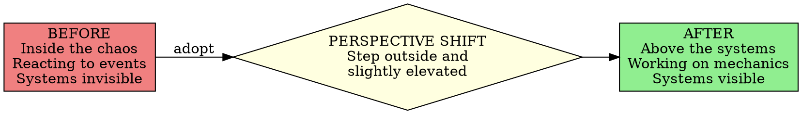

# Work the System Mindset

## Overview

**Core Principle:** Step outside and slightly elevated to view your life/business as a collection of manageable systems rather than chaotic events. Life is 99.9% efficient when systems are managed; inefficiency stems from rare component failures within otherwise perfect systems.

This is the foundational perspective shift that enables all systematic improvement.

## When to Use

Use this skill when you observe these symptoms:

**Fire-Killing Mode:**
- Constant reactive problem-solving
- Same issues recurring without pattern recognition
- Working harder but not making progress
- Exhaustion from perpetual crisis management

**Perspective Problems:**
- Viewing world as chaotic and unpredictable
- Blaming external factors (people, events, luck)
- Feeling powerless over circumstances
- Unable to see connections between events

**System Blindness:**
- Can't identify root causes
- Fixing symptoms instead of sources
- No distinction between controllable and uncontrollable
- Overwhelmed by complexity

**Ready for Change:**
- Starting business improvement initiative
- Need systematic approach to problems
- Want to move from reactive to proactive
- Completed crisis but need prevention strategy

## Core Pattern



**The Fundamental Shift:**

| Old View | New View |
|----------|----------|
| Life is chaos | Life is 99.9% efficient systems |
| I'm a victim | I control my systems |
| Fix symptoms | Fix system components |
| React to fires | Prevent fires via system design |
| Blame external factors | Manage internal systems |
| Work harder | Work on systems |

## Quick Reference

### The Systems Hierarchy

1. **Primary Systems** - Major life areas (business, health, relationships)
2. **Subsystems** - Components within primary systems (hiring, exercise, communication)
3. **Sub-subsystems** - Detailed processes (interview protocol, workout routine, check-in ritual)

**Key Insight:** Fix subsystems → Primary system improves automatically

### Circle of Influence Framework

**Inside Circle (Control):**
- Your systems and processes
- Your documentation
- Your habits and routines
- Your team's procedures
- Your responses and reactions

**Outside Circle (No Control):**
- Other people's behavior
- Market conditions
- Competitor actions
- World events
- Past events

**Rule:** Expend energy ONLY on what's inside your circle. Let go of the rest.

### The 99.9% Efficiency Principle

**Reality:** This world operates at 99.9% efficiency because:
- Physical laws are consistent
- Systems naturally seek efficiency
- Cosmic propensity toward order (not chaos)
- Human-designed systems work when built properly

**Corollary:** Inefficiency = rare component failures, not cosmic chaos

**Application:** When you see "chaos," you're actually seeing a few broken components within an otherwise efficient system. Fix the components, not the world.

## Implementation

### Step 1: Adopt Outside-and-Slightly-Elevated Perspective

**How:**
1. **Physically visualize rising** - Imagine floating up and out of your situation
2. **Look down at the landscape** - See your life/business spread out below like a map
3. **Identify separate systems** - Note distinct areas: business operations, customer service, accounting, health, relationships
4. **See the mechanisms** - Each system is a machine with component parts

**Practice:**
- Take 5 minutes daily to "float above" your day
- Sketch a simple diagram of your primary systems
- Label each system as a separate entity

### Step 2: Identify Primary Systems and Subsystems

**For Business:**
- Primary: The entire business
- Subsystems: Sales, operations, finance, HR, customer service
- Sub-subsystems: Lead generation, order processing, invoicing, hiring, support tickets

**For Personal Life:**
- Primary: Your life
- Subsystems: Health, relationships, finances, career, personal growth
- Sub-subsystems: Exercise routine, date nights, budgeting, skill development, reading habit

**Exercise:**
```
My Primary System: [Business Name / My Life]
├── Subsystem 1: [Sales / Health]
│   ├── Lead generation
│   ├── Sales calls
│   └── Closing process
├── Subsystem 2: [Operations / Relationships]
│   ├── Order fulfillment
│   ├── Quality control
│   └── Shipping
└── Subsystem 3: [Finance / Career]
    ├── Invoicing
    ├── Collections
    └── Reporting
```

### Step 3: Map Circle of Influence

**Create Two Lists:**

**I CAN Control (Inside Circle):**
- How I respond to situations
- My daily routines
- My documentation practices
- My team's training
- Our standard procedures
- System improvements I make
- My focus and attention

**I CANNOT Control (Outside Circle):**
- Competitor actions
- Economic conditions
- Other people's opinions
- Yesterday's events
- Client mood swings
- Traffic patterns
- Weather

**Action:** For next 7 days, when stressed, ask: "Is this inside or outside my circle?" If outside, immediately let it go.

### Step 4: See Systems Not Chaos

**Reframe Problems as System Components:**

| Problem Statement | System Reframe |
|-------------------|----------------|
| "Customers are always upset" | "Our customer communication system has a component failure" |
| "I never have time" | "My time allocation system needs redesign" |
| "Staff make too many errors" | "Our training and procedure systems have gaps" |
| "Sales are unpredictable" | "Our lead generation system lacks consistency" |

**Practice:** When you say "We have a problem with X," rephrase as "Our X system has a component that needs fixing."

### Step 5: Identify Root Causes Not Symptoms

**Two-Question Method:**

1. **What is the symptom?** (What you're experiencing)
2. **What system produced this symptom?** (Go deeper)

**Example:**
- Symptom: "Customer complained about late delivery"
- System question: "Which system component caused late delivery?"
- Root cause: "Order notification process doesn't trigger shipping alert"
- Fix: "Add automated alert to shipping system when order placed"

**Rule:** Never fix a symptom. Always trace back to the system component that produced it.

### Step 6: Accept the Propensity for Order

**Mindset Shift:**
- The universe WANTS efficiency
- Systems WANT to work properly
- You're working WITH cosmic forces, not against them
- Order is natural; chaos is the anomaly
- Well-designed systems naturally perpetuate themselves

**Practical Application:**
When improving a system, you're aligning with universal propensity for order. The force is WITH you, not against you. Your job is simply to remove obstacles and design proper mechanisms.

## Common Mistakes

### Mistake 1: Staying Inside the Chaos

**Symptom:** Still feeling like part of the problem, reacting emotionally, can't see patterns

**Fix:** Physically step back. Take a walk. Draw it on paper. Force the outside perspective by externalizing the view. You can't see the system while you're drowning in it.

### Mistake 2: Trying to Control the Uncontrollable

**Symptom:** Frustrated by things outside your circle, obsessing over others' behavior, angry at "the system"

**Fix:** Ruthlessly cut energy spent on outside-circle items. When you catch yourself worrying about uncontrollables, immediately redirect to: "What inside my circle CAN I improve right now?"

### Mistake 3: Fixing Symptoms Instead of Systems

**Symptom:** Same problems recurring, putting out same fires, temporary fixes that don't last

**Fix:** Every time you "solve" a problem, ask: "What system produced this problem?" Then fix the system, not the symptom. Document the system fix so it stays fixed.

### Mistake 4: Blaming People Instead of Processes

**Symptom:** "If only Bob would...", "The team just doesn't care", "Customers are unreasonable"

**Fix:** People execute systems. If execution is bad, the system is broken (unclear instructions, missing training, no documentation, conflicting priorities). Fix the system that governs their work.

### Mistake 5: Expecting Instant Transformation

**Symptom:** Frustrated that mindset shift doesn't immediately fix everything, giving up too soon

**Fix:** Perspective shift is instant. System improvements are incremental. You see the systems NOW. You fix them ONE AT A TIME over weeks/months. Both are necessary.

### Mistake 6: Seeing Chaos Instead of 99.9% Efficiency

**Symptom:** "Everything is broken", "Nothing works", "Total disaster"

**Fix:** Force yourself to list what IS working. You'll find 99% works perfectly. The 0.1% broken stands out because it disrupts the 99.9% that's efficient. Acknowledge the efficiency, then fix the 0.1%.

## Real-World Impact

**Sam Carpenter's Centratel Example:**
- Before: 100-hour workweeks, constant crisis, business near failure
- Mindset shift: "Centratel is a machine composed of systems"
- After: 2-hour workweeks, highest quality in industry, 7-year average client tenure
- Transformation time: Immediate perspective shift, 6-12 months systematic improvement

**Key Quote from Carpenter:**
> "Unhappy people spend days coping with unintentional bad results of unmanaged systems. Happy people spend days enjoying intentional good results of managed systems."

**Measurable Results:**
- Error rate: 1 per 9,277 messages processed
- Staff turnover: Minimal (drug-free policy ensures stable workforce)
- Manager workweeks: Never exceed 40 hours
- Owner workweek: 2 hours
- Industry ranking: Top 1% quality

## Next Steps

After adopting this mindset, proceed to:

1. **strategic-objective-creation** - Define direction for your primary systems
2. **operating-principles-development** - Create decision-making guidelines
3. **working-procedures-documentation** - Systematically improve and document each subsystem

**IMPORTANT:** This mindset is the foundation. The other three skills won't work without this perspective shift first.

## Quick Self-Assessment

You've successfully adopted the systems mindset when you can:

- [ ] Name your 3-5 primary systems
- [ ] List subsystems within each primary system
- [ ] Distinguish controllable from uncontrollable factors
- [ ] See recurring problems as system component failures
- [ ] Automatically ask "What system produced this?" instead of "Who's to blame?"
- [ ] Feel calm viewing problems from outside-and-slightly-elevated position
- [ ] Recognize that 99.9% of your world already works efficiently
- [ ] Stop attempting to control things outside your circle

If you can't check these boxes, spend more time with Steps 1-6 above before moving to documentation skills.
