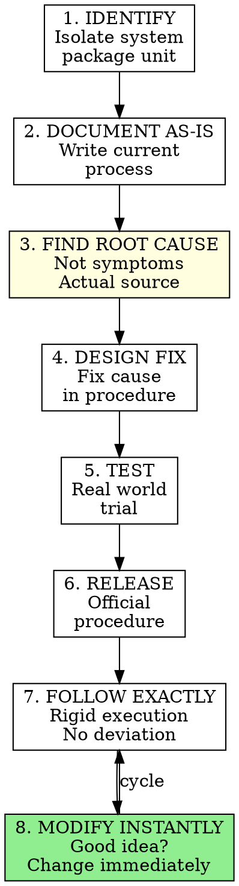

# Working Procedures Documentation

## Overview

**Core Truth:** The difference between a large successful business and a small struggling one = **DOCUMENTATION**.

Undocumented organic systems vary with mood, time, weather - unpredictable and chaotic. Documentation makes systems tangible, concrete, dependable, and improvable.

**Working Procedures are:**
- Step-by-step protocols for EVERY recurring task
- 95% linear format (1-2-3 steps), 5% narrative
- "Off-the-street" simple - anyone could follow
- The blue-collar tools of system improvement
- Created by staff (98%), approved by leader

**The Transformation:** From fire-killing to system improvement. From "fix this problem" to "fix the system that created this problem."

## When to Use

Use this skill when you observe these symptoms:

**Recurring Problems:**
- Same problems happening repeatedly
- Fixing same fires over and over
- Issues you thought were solved reappearing
- No root cause analysis, just symptom treatment
- Pattern of recurring inefficiencies

**Execution Inconsistency:**
- Same task done different ways by different people
- Same person doing task differently each time
- Results vary based on who's doing the work
- Quality unpredictable
- Errors blamed on people, not systems

**Training Nightmares:**
- Training new people takes forever
- Extensive shadowing required
- Can't delegate because "only I know how"
- Knowledge trapped in people's heads
- Staff turnover creates chaos

**Organizational State:**
- Undocumented organic processes
- Expecting staff to read your mind
- No written protocols for recurring tasks
- "Feathers in the wind" - nothing written down
- Ad-hoc approaches to everything

**Ready for Implementation:**
- Strategic Objective created and finalized
- Operating Principles developed and stable
- Want to move from reactive to proactive permanently
- Ready for systematic process improvement
- Committed to documentation work

## Core Pattern



**The Fundamental Shift:**

| Fire-Killing Mode | System Improvement Mode |
|-------------------|-------------------------|
| Fix this problem | Fix the system creating problems |
| Treat symptoms | Fix root causes |
| Blame people | Fix processes |
| Expect mind-reading | Provide exact protocols |
| Organic variation | Documented consistency |
| Work harder | Work on systems |

## Quick Reference

### Working Procedure Specifications

**Format:**
- **95% of procedures:** Linear 1-2-3 steps
- **5% of procedures:** Narrative or bullet points (for nonlinear systems)
- **Simplicity standard:** "Off-the-street" - anyone could follow
- **Length:** As long as needed (Deposit Procedure: 53 steps → refined to 23)

**Creation:**
- **Creator:** Staff creates 98% of procedures
- **Approver:** Leader reviews and approves
- **Iteration:** Continuously refined and improved
- **Evolution:** Constantly evolving = validity confirmation

**Execution:**
- **Rule:** Follow EXACTLY as written
- **Modification:** Instant when improvement identified
- **Accountability:** If followed exactly and error occurs, procedure at fault (not person)

**Time Investment:**
- **Initial:** 1-2 hours/day creating procedures
- **Per procedure:** 4-7 hours for first version
- **Return:** Time savings begin immediately
- **Long-term:** Geometric accumulation of efficiency

### The Three-Step Procedure Creation Process

**Step 1: Document Current State**
- Write down how it's done NOW (not how it should be)
- Linear 1-2-3 format for most systems
- Capture actual process, warts and all

**Step 2: Analyze and Fix**
- Find ROOT CAUSE of inefficiencies (not symptoms)
- Design fixes targeting actual source
- Build fixes into procedure

**Step 3: Test and Release**
- Test in real world
- Refine based on feedback
- Release as official procedure
- Staff follows EXACTLY
- Modify INSTANTLY when improvements identified

### Working Procedures in the System Hierarchy

```
Strategic Objective (WHAT/WHERE/HOW)
        ↓ guides
Operating Principles (DECISION FILTERS)
        ↓ filters
Working Procedures (EXACT EXECUTION)
```

All three documents work together:
- Strategic Objective provides direction
- Operating Principles guide decisions
- Working Procedures execute the work

## Implementation

### Step 1: Ensure Foundation Documents Exist

**Prerequisite Check:**
- [ ] Strategic Objective created (one page, present tense)
- [ ] Operating Principles developed (15-30 principles)
- [ ] Both documents finalized and in use
- [ ] Systems mindset adopted (outside-and-slightly-elevated)

**If not ready:** Complete strategic-objective-creation and operating-principles-development skills first. Working Procedures must align with SO and follow Principles. Foundation first, then execution.

### Step 2: Identify Starting System

**Don't start randomly.** Choose strategically:

**Priority 1: Most Troublesome Systems**
- Biggest pain points
- Highest error rates
- Most recurring problems
- Greatest time waste
- Most customer complaints

**Priority 2: Most Critical Systems**
- Core business functions
- Revenue-generating activities
- Customer-facing processes
- High-impact operations

**Priority 3: Easiest Wins**
- Simple systems for practice
- Quick time savings
- Build momentum
- Develop procedure-writing skills

**The Deposit Procedure Example:**
- Problem: 3 people doing it different ways, frequent errors, lost deposits, time wasted
- Impact: High (financial and customer-facing)
- Complexity: Moderate (good first choice)
- Result: 7 months of workweeks saved over 12 years

**Start with ONE system.** Master the process before scaling.

### Step 3: Isolate the System Package Unit

**What is a system package unit?**
- Self-contained process with clear boundaries
- Has defined start and end points
- Can be documented independently
- Manageable scope

**Examples:**
- "Deposit Procedure" (not "All Accounting")
- "Answer Incoming Call" (not "All Customer Service")
- "Weekly Report Generation" (not "All Reporting")
- "New Hire Onboarding Day 1" (not "All HR")

**Too broad:**
- "Customer Service"
- "Accounting"
- "Sales Process"

**Right scope:**
- "Handle Customer Complaint Call"
- "Daily Cash Reconciliation"
- "Initial Sales Call Protocol"

**Isolation Process:**
1. Name the specific task
2. Define start point (when does this begin?)
3. Define end point (when is this complete?)
4. List inputs (what's needed to start?)
5. List outputs (what's produced at end?)

### Step 4: Document Current State (As-Is)

**CRITICAL:** Document how it's ACTUALLY done now, not how you think it should be done.

**For 95% of systems (linear processes):**

Use numbered 1-2-3 step format:

```
PROCEDURE NAME: [Task Name]

PURPOSE: [Why this procedure exists]

1. [First action step]
   Details if needed

2. [Second action step]
   Details if needed

3. [Third action step]
   Details if needed

[Continue through all steps...]
```

**Example from Deposit Procedure:**
```
CENTRATEL DEPOSIT PROCEDURE

1. Open bank deposit slip and check register

2. Compare checks to invoice amounts in ledger

3. Enter check amount in deposit slip

4. Enter check amount in register

5. Write invoice number on back of check

[...continue through all 53 steps...]
```

**For 5% of systems (nonlinear processes):**

Use narrative or bullet point format:

```
PROCEDURE NAME: [Task Name]

OVERVIEW: [General approach]

KEY COMPONENTS:
- [Component 1]
- [Component 2]
- [Component 3]

GUIDELINES:
- [Guideline 1]
- [Guideline 2]

[Additional narrative as needed]
```

**Documentation Tips:**
- Write as if for someone "off the street"
- Include every step (obvious to you ≠ obvious to others)
- Use simple language
- Number steps for reference
- Include decision points ("If X, then Y")
- Note required tools/systems
- Specify timing when critical

### Step 5: Find ROOT CAUSE (Not Symptoms)

**THIS IS THE CRITICAL STEP.** Most people skip this and wonder why problems recur.

**The Root Cause Question:**
"What SYSTEM component produced this problem?"

**Example - Symptom vs Root Cause:**

*Symptom:* "Customer complained about late delivery"

*Surface cause:* "Shipping didn't send package on time"

*Root cause:* "Order notification process doesn't trigger shipping alert"

**Fix symptom:** Tell shipping to be more careful
**Result:** Problem recurs

**Fix root cause:** Add automated alert to shipping system when order placed
**Result:** Problem solved permanently

**The Five Whys Technique:**

Ask "Why?" five times to get to root cause:

1. "Why was delivery late?" → Shipping didn't process order
2. "Why didn't shipping process order?" → They didn't know about it
3. "Why didn't they know?" → No notification sent
4. "Why wasn't notification sent?" → No automatic alert system
5. "Why no automatic alert?" → **ROOT CAUSE: Notification step not in procedure**

**Root Cause vs Symptom Table:**

| Symptom | Root Cause |
|---------|------------|
| Staff makes errors | No written procedure to follow |
| Customer upset | Communication system has gaps |
| Task takes too long | Process has unnecessary steps |
| Inconsistent results | No standard method documented |
| Training takes forever | No procedure to hand new person |

**ALWAYS fix root cause, NEVER just treat symptom.**

### Step 6: Design Fix in Procedure

**Incorporate fix into documented procedure:**

**Before (symptom treatment):**
```
15. Ship order when ready
```

**After (root cause fix):**
```
15. When order placed, system automatically sends shipping alert

16. Shipping receives alert with order details

17. Shipping confirms receipt of alert in system

18. Ship order within 24 hours of alert
```

**Types of Fixes:**

**1. Add missing steps:**
- Identified gap in process
- Add explicit step to procedure

**2. Remove unnecessary steps:**
- Step wastes time
- Provides no value
- Delete from procedure

**3. Reorder steps:**
- Step order inefficient
- Rearrange for logic/flow

**4. Automate steps:**
- Manual step can be automated
- Replace with system automation
- Note automation in procedure

**5. Add decision points:**
- Process branches based on conditions
- Add "If X, then Y" logic

**6. Add quality checks:**
- Errors occur at specific point
- Add verification step

**Design Principles:**
- Fix causes, not symptoms
- Simplify whenever possible
- Automate whenever possible
- Eliminate useless steps entirely
- Make it "off-the-street" simple

### Step 7: Create "Off-the-Street" Format

**The Off-the-Street Standard:**

Could someone literally off the street (with relevant baseline skills) perform this task following your procedure?

**Why this matters:**
- Saves enormous training time
- Enables true delegation
- Fresh eyes spot improvement opportunities
- Creates independence from key person dependency

**For specialists:**
- "Off-the-street electrical engineer" (has baseline skills, can follow your specific procedure)
- "Off-the-street accountant" (knows accounting, can follow your exact process)
- "Off-the-street developer" (codes, can follow your architecture procedure)

**How to achieve it:**

**1. Assume nothing:**
- Don't skip "obvious" steps
- Don't use internal jargon without definition
- Don't assume knowledge of tools/systems

**2. Be explicit:**
- "Click the blue 'Submit' button in upper right"
- Not: "Submit the form"

**3. Include screenshots/diagrams when helpful:**
- System interfaces
- Physical layouts
- Decision trees

**4. Define terms:**
- First use of term → brief definition
- Maintain glossary for complex procedures

**5. Test with new person:**
- Have someone unfamiliar perform task using only your procedure
- Note every question they ask
- Add clarification for each question
- Retest until zero questions

### Step 8: Test in Real World

**Testing Process:**

**1. Give procedure to staff person**
- Choose someone who does this task (if existing process)
- Or someone who will do it (if new process)
- Provide ONLY the written procedure

**2. Observe execution:**
- Watch them follow procedure
- Note where they pause/question
- Note any steps unclear
- Note any errors that occur

**3. Gather feedback:**
- "Which steps were confusing?"
- "What's missing?"
- "What could be clearer?"
- "What seems unnecessary?"

**4. Refine based on feedback:**
- Clarify unclear steps
- Add missing steps
- Remove unnecessary complexity
- Reorder for better flow

**5. Test again:**
- Repeat until smooth execution
- Zero questions = ready
- Expect 2-3 test cycles

**The Deposit Procedure Example:**
- First version: 4 hours to compose
- Refinement: 3 more hours over couple days
- Final: 53 individual steps
- Testing revealed gaps, added steps
- Result: Only one small error in 12 years

### Step 9: Release as Official Procedure

**Release Process:**

**1. Leader review and sign-off:**
- Check alignment with Strategic Objective
- Check compliance with Operating Principles
- Verify fixes address root causes
- Approve or request revisions

**2. Communicate to team:**
- "New procedure for [task] is now official"
- Explain WHY procedure exists
- Show how it aligns with SO and Principles
- Set expectations for exact execution

**3. Make accessible:**
- Store in central location
- Easy to find and reference
- Digital or physical (or both)
- Version control if needed

**4. Train staff:**
- Walk through procedure once
- Answer questions
- Observe first execution
- Confirm understanding

**5. Set execution expectation:**
- **MUST follow exactly as written**
- No deviations allowed
- Any improvement ideas → suggest procedure modification
- If followed exactly and error occurs → procedure's fault, not person's

### Step 10: Execute with Rigid Discipline

**The Rigid Execution Rule:**

Staff must follow procedure EXACTLY as written. No exceptions. No deviations. No "I have a better way."

**Why rigid execution matters:**

**1. Predictable results:**
- Same inputs → same outputs
- Consistency across all executions
- Quality doesn't vary by person/mood

**2. Isolates problems:**
- Error occurs → problem is in procedure
- Not: "Bob did it wrong"
- But: "Procedure has a flaw at step 12"

**3. Enables improvement:**
- Can't improve what changes constantly
- Stable process → measurable → improvable

**4. No blame culture:**
- Followed exactly and error → fix procedure
- Removes personal fault
- System accountability, not people accountability

**Communication to Staff:**

"You must follow this procedure exactly as written. If you have an idea for improvement, that's great - suggest a modification to the procedure itself. But while executing, follow it precisely. If you follow it exactly and something goes wrong, the procedure is at fault, not you."

### Step 11: Modify Instantly When Improved

**The Instant Modification Rule:**

When someone identifies an improvement, implement it IMMEDIATELY. No bureaucracy. No committee. No waiting.

**Why instant modification matters:**

**Staff buy-in - 4 reasons staff embrace rigid procedures:**

1. **Simple logic** - It works, so they believe
2. **Involvement** - They create/approve nearly all procedures (98% at Centratel)
3. **Instant modification** - Good ideas implemented immediately, no bureaucracy
4. **No blame** - Procedure followed exactly and error occurs → procedure at fault, not person

**The Modification Process:**

**1. Staff member suggests improvement:**
- "Step 15 could be eliminated"
- "Steps 7-9 could be reordered for efficiency"
- "We could automate step 12"

**2. Quick evaluation:**
- Does it maintain/improve quality?
- Does it align with SO and Principles?
- Does it make sense?

**3. If yes → implement immediately:**
- Update procedure documentation
- Communicate change to all staff
- New version becomes official
- Old version archived

**4. Track evolution:**
- Procedure version history
- Note improvements made
- Measure time/quality gains

**Example - Deposit Procedure Evolution:**
- Original: 53 steps
- Continuous improvement over 12 years
- Current: 23 steps
- Streamlined through staff suggestions
- Quality improved while time decreased

**Rigid AND Flexible:**
- Rigid: Follow current version exactly
- Flexible: Modify current version instantly when improvement identified
- Both principles work together

### Step 12: Create "Procedure for Procedures" Template

**After you've created 3-5 procedures yourself, create the meta-procedure:**

A "Procedure for Procedures" is the master template staff uses to create new procedures.

**Why this matters:**
- Delegates 98% of procedure creation to staff
- Ensures consistency in format
- Scales the documentation process
- Leader shifts from creator to approver

**Procedure for Procedures Template:**

```
PROCEDURE FOR CREATING PROCEDURES

PURPOSE: Standard format for documenting all Centratel processes

1. IDENTIFY THE SYSTEM
   - Choose specific task (not too broad)
   - Define start and end points
   - Confirm it's recurring (not one-time)

2. DOCUMENT CURRENT STATE
   - Write how it's ACTUALLY done now
   - Use numbered 1-2-3 step format (95% of cases)
   - Include every step (assume reader knows nothing)
   - Write for "off-the-street" person

3. FIND ROOT CAUSES
   - Identify inefficiencies in current process
   - Ask "Why?" five times to find root cause
   - Target actual source, not symptoms

4. DESIGN FIXES
   - Build root cause fixes into procedure
   - Eliminate unnecessary steps
   - Automate where possible
   - Add quality checks
   - Reorder for optimal flow

5. TEST WITH REAL PERSON
   - Give procedure to someone who will use it
   - Observe execution
   - Note questions and confusion points
   - Refine based on feedback
   - Test again until smooth

6. SUBMIT FOR APPROVAL
   - Send to [Leader] for review
   - Include: procedure, why it's needed, expected benefits
   - Leader checks alignment with Strategic Objective and Operating Principles

7. RELEASE AND TRAIN
   - After approval, communicate to team
   - Store in [central location]
   - Train staff on execution
   - Set expectation: follow exactly, suggest improvements

8. FORMAT REQUIREMENTS
   - Title: Clear task name
   - Purpose: Why this procedure exists
   - Steps: Numbered 1-2-3 format
   - Details: Enough for "off-the-street" execution
   - Version: Date and version number

9. CONTINUOUS IMPROVEMENT
   - Accept improvement suggestions
   - Evaluate quickly
   - Implement good ideas immediately
   - Track version history
```

**Delegation Achievement:**
- Staff creates 98% of procedures following this template
- Leader reviews and approves (ensures alignment)
- System becomes self-documenting
- Leader's time freed for strategic work

### Step 13: Scale Systematically

**After first procedure success, scale the process:**

**Month 1-2: Leader creates first 3-5 procedures**
- Master the process yourself
- Document most critical systems
- Demonstrate commitment
- Gather lessons learned

**Month 3: Create Procedure for Procedures**
- Based on your experience
- Make it "off-the-street" simple
- Include your template

**Month 4-6: Train staff to create procedures**
- Assign each staff member 1-2 systems they own
- They create procedures using your template
- You review and approve
- Celebrate completed procedures

**Month 7+: Continuous documentation**
- Make procedure creation ongoing priority
- 1-2 hours/week minimum per staff member
- New procedures added monthly
- Existing procedures continuously refined

**Prioritization Across Systems:**

**Phase 1:** Most troublesome/critical (you create these)
**Phase 2:** Frequently recurring tasks (staff creates)
**Phase 3:** Moderately recurring tasks (staff creates)
**Phase 4:** Rarely recurring but important (staff creates)

**Goal:** Document EVERYTHING recurring. If it happens more than once, it needs a procedure.

### Step 14: Pay Staff to Improve Systems

**Incentive System:**

At Centratel, staff are paid bonuses tied to system improvement recommendations.

**Why this works:**
- Aligns staff incentives with organizational goals
- Encourages active system thinking
- Rewards proactive improvement
- Creates culture of continuous optimization

**Implementation:**
- Bonus tied to suggestions implemented
- Or: bonus for procedures created
- Or: bonus for measurable time/quality gains
- Make system improvement part of compensation

**Result:** Staff continuously work systems, not just kill fires.

### Step 15: Eliminate Useless Systems

**Not all systems should exist.**

**During procedure creation, ask:**
- "Why do we do this at all?"
- "What would happen if we stopped?"
- "Does this support our Strategic Objective?"
- "Does this pass our Operating Principles?"

**If answers reveal system is useless:**
- DELETE the entire system
- Don't document it
- Eliminate the work entirely

**Example from book:**
- Analyzed system thoroughly
- Discovered it contributed nothing
- Eliminated entire process
- Saved time permanently

**Ruthless Deletion:**
- Every procedure must justify its existence
- Contribution to SO must be clear
- If it fails test → delete system entirely
- Documentation reveals waste

### Step 16: Automate Wherever Possible

**Automation = Ultimate Delegation**

**Machines are the perfect staff:**
- Never sick
- Never late
- Never moody
- Perfect consistency
- Zero training needed
- Work 24/7

**During procedure creation, ask:**
- "Could a machine do this step?"
- "Could software automate this?"
- "Could we eliminate human intervention?"

**Automation Opportunities:**
- Data entry → database automation
- Calculations → spreadsheet formulas
- Notifications → automated alerts
- Scheduling → calendar automation
- Reporting → auto-generated reports
- File organization → automated filing
- Data transfer → API integration

**Document Automation in Procedure:**

Instead of:
```
5. Calculate totals manually
```

Write:
```
5. Totals calculate automatically in column F
   (formula: =SUM(A1:A50))
```

**Progression:**
1. Document manual process
2. Identify automation opportunities
3. Implement automation
4. Update procedure to reflect automation
5. Human executes remaining non-automated steps

## Common Mistakes

### Mistake 1: Starting Without Foundation Documents

**Symptom:** Jumping straight to procedure creation without Strategic Objective or Operating Principles

**Fix:** STOP. Complete strategic-objective-creation and operating-principles-development skills first. Procedures must align with direction (SO) and follow guidelines (Principles). Without foundation, you'll create procedures that don't serve your goals.

### Mistake 2: Documenting How It "Should Be" Instead of "Is"

**Symptom:** Writing idealized procedure rather than current reality

**Fix:** Document ACTUAL current state first, warts and all. Then analyze and fix. You can't improve what you haven't honestly assessed. Reality first, improvement second.

### Mistake 3: Fixing Symptoms Instead of Root Causes

**Symptom:** Procedure addresses surface problem but issue recurs

**Fix:** Use Five Whys technique. Ask "Why?" repeatedly until you reach actual source. Fix the ROOT CAUSE in the procedure, not the symptom. This is THE critical step most people skip.

### Mistake 4: Making Procedures Too Vague

**Symptom:** "Handle customer complaints professionally" or "Process deposit correctly"

**Fix:** Be specific. Every single step. "Off-the-street" standard means someone unfamiliar could execute perfectly following only your written procedure. If it's not specific enough for that, it's too vague.

### Mistake 5: Allowing Procedure Deviations

**Symptom:** "I have a better way" or "I know what I'm doing, don't need to follow exact steps"

**Fix:** Rigid execution is NON-NEGOTIABLE. Staff must follow EXACTLY as written. Want to improve it? Great - suggest modification to the procedure itself. But during execution, no deviations. Period.

### Mistake 6: Bureaucratic Modification Process

**Symptom:** "Submit improvement suggestion to committee, will review next quarter"

**Fix:** Instant modification when good idea identified. Evaluate quickly (minutes, not weeks). If it improves quality/efficiency and aligns with SO/Principles, implement IMMEDIATELY. Speed of iteration = staff buy-in.

### Mistake 7: Leader Creates All Procedures

**Symptom:** You're writing every procedure yourself, overwhelmed, can't scale

**Fix:** Create first 3-5 yourself to master process. Then create "Procedure for Procedures" template. Train staff to create 98% of procedures. You review and approve. Delegation is essential.

### Mistake 8: Making It Spare-Time Work

**Symptom:** "I'll work on procedures when I have free time" (which never comes)

**Fix:** Make procedure creation #1 PRIORITY. Block 1-2 hours/day initially. This is not spare-time work - it's mandatory infrastructure investment. Time savings begin immediately and compound. No such thing as "spare time" - MAKE the time.

### Mistake 9: Keeping Procedures in Your Head

**Symptom:** "I know how to do it, don't need to write it down"

**Fix:** Unwritten = doesn't exist. "Feathers in the wind" without documentation. Can't delegate, can't improve, can't scale. WRITE IT DOWN. Physical documentation is mandatory.

### Mistake 10: Not Testing with Real People

**Symptom:** Write procedure, assume it's clear, release without testing

**Fix:** Test with actual staff member who will use it. Give them ONLY the written procedure. Watch them execute. Note every question. Refine. Test again. Repeat until zero questions. Testing reveals gaps your brain filled automatically.

## Real-World Impact

**Sam Carpenter's Centratel Example:**

**Before Working Procedures:**
- 15 years of chaos
- Fire-killing mode
- Unpredictable results
- High error rates
- 100-hour workweeks
- Business near failure

**Deposit Procedure Specific Results:**
- **Time invested:** 4 hours to compose + 3 hours to refine = 7 hours total
- **Time saved:** 2 hours/week eliminated
- **Cumulative savings:** 7 months of workweeks over 12 years
- **Error rate:** Only 1 small error in 12 years
- **Evolution:** 53 steps → 23 steps (continuous improvement)
- **Delegation:** Leader completely delegated task by handing over procedure

**Centratel Overall Results:**
- **Error rate:** 1 per 9,277 messages processed
- **Owner workweek:** 2 hours (from 100 hours)
- **Manager workweeks:** Never exceed 40 hours
- **Staff turnover:** Minimal
- **Client tenure:** 7-year average
- **Industry ranking:** Top 1% quality
- **Documentation culture:** 98% of procedures created by staff

**Key Quote:**
> "The difference between a large successful business and a small struggling one = documentation. Undocumented organic systems vary with mood, time, weather. Documentation makes systems tangible, concrete, dependable."

**Transformation Timeline:**
- **Immediate:** Perspective shift (systems mindset)
- **Week 1-2:** Strategic Objective created
- **Month 1-2:** Operating Principles developed
- **Month 1-2:** First Working Procedures created
- **Month 3-6:** Staff trained to create procedures
- **6-12 months:** Systematic transformation visible
- **Years:** Geometric accumulation of efficiency

**The Cycle of Increasing Returns:**
1. Better preparation → Better command of events
2. Better command → Higher efficiency
3. Higher efficiency → More available time
4. More time → Reinvested in preparation
5. Loop continues upward infinitely

## Next Steps

After creating your first Working Procedures:

1. **Continue systematically** - Document one system at a time
2. **Create "Procedure for Procedures"** - Enable staff to create procedures
3. **Train staff** - Delegate 98% of procedure creation
4. **Review and approve** - Leader ensures alignment with SO and Principles
5. **Maintain rigid execution + instant modification** - Both principles together
6. **Work the system, don't kill fires** - Permanent shift in focus

**IMPORTANT:** This is ongoing work, not a one-time project. Procedure creation and refinement continues indefinitely. This becomes THE way you work.

## Quick Self-Assessment

You've successfully implemented Working Procedures when you can:

- [ ] Created first complete procedure (documented, tested, released)
- [ ] Procedure follows "off-the-street" standard
- [ ] Root cause identified and fixed (not just symptom)
- [ ] Staff follows procedure exactly as written
- [ ] Successfully delegated task via procedure handoff
- [ ] Measurable time savings from procedure
- [ ] Created "Procedure for Procedures" template for staff
- [ ] Staff creating procedures following your template
- [ ] Instant modification process in place
- [ ] Culture shift visible: system improvement replaces fire-killing

If you can't check these boxes, revisit Steps 1-16 above. Start with one procedure and master the complete cycle before scaling.

## Procedure Template

**Standard Linear Format (95% of procedures):**

```
PROCEDURE TITLE
[Specific task name]

PURPOSE
[Why this procedure exists, how it supports Strategic Objective]

REQUIRED MATERIALS/SYSTEMS
- [Item 1]
- [Item 2]

VERSION: [Date] v[Number]

PROCEDURE STEPS:

1. [First action step with specific details]

2. [Second action step with specific details]

3. [If a decision point: "If X, proceed to step 7. If Y, continue to step 4."]

4. [Action step]

5. [Action step with additional detail:
   - Sub-point if needed
   - Sub-point if needed]

6. [Quality check step: "Verify [specific thing] matches [specific standard]"]

7. [Continue through all steps...]

[Final step that marks completion]

QUALITY STANDARD
[How to know this was done correctly]

NOTES
[Any additional context, common issues, or tips]
```

**Use this template for all linear procedures. Adjust as needed for nonlinear procedures.**

---

## Personal Life Application

**From the book:**

Working Procedures are NOT necessary for personal life. Mental internalization is sufficient since you're the only operator.

**Exceptions where written procedures help:**
- Travel/packing checklists
- Complex technical instructions (home repair)
- Recipes you make occasionally
- Shopping lists for specific events

**But generally:** For personal systems, the mindset alone is enough. Apply outside-and-slightly-elevated view, identify subsystems, improve them mentally. No need for written procedures.

**Focus Working Procedures on:** Business, work, organizational systems where multiple people execute tasks and consistency matters.

---

**You now have the complete Work the System methodology:**

1. **Systems Mindset** - Foundation perspective shift
2. **Strategic Objective** - One-page direction document
3. **Operating Principles** - Decision-making guidelines
4. **Working Procedures** - Exact execution protocols

All four work together. Don't skip steps. Follow the sequence. Transform from chaos to order.
